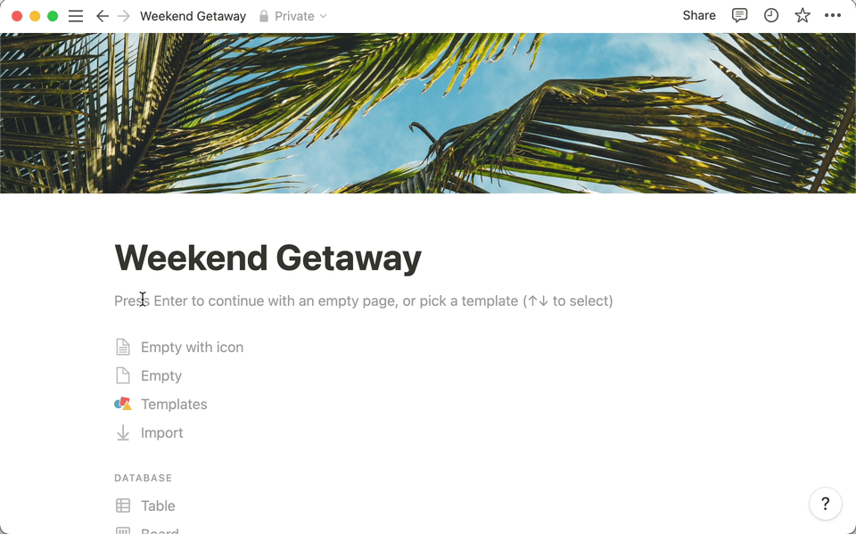

# Obsidian share to NotionNext
感谢[原作者](https://github.com/EasyChris/obsidian-to-notion)开发出了这么好用的插件，能够将obsidian同步到notion。 但是原仓库只能同步Name和Tags信息，如果像我一样通过[NotionNext](https://github.com/tangly1024/NotionNext)来搭建自己的网页，就有一些局限性。每次导入之后都需要进行大量的修改。

所以我在[原作者](https://github.com/EasyChris/obsidian-to-notion)的基础之上，增加了匹配[NotionNext](https://github.com/tangly1024/NotionNext)模板的功能。这样可以直接在Obsidian编辑，整理好之后一键发布。
## 更新说明
### 0.1.7
- [x] 删除了设置中`convert tags`的选项。 你现在可以直接添加tags，而不需要考虑是否开启tags选项。如果你不需要tags，可以直接删除tags选项或者留白。

## 使用方式
### 注意事项
本插件现在暂时只能用于匹配[NotionNext](https://github.com/tangly1024/NotionNext)。如果你不是使用这个模板，你只会无限返回`error 400`. 

所以没有NotionNext需求的，请使用原作者的[Obsidian-to-notion](https://github.com/EasyChris/obsidian-to-notion)

### 准备安装
在安装插件之前，你必须配置好了以下内容：

1. 你的NotionNext数据库。
2. 根据原作者的readme.md，配置好了Notion API，并且已经和你的NotionNext仓库关联。
3. NotionNext Database ID
4. 你的NotionNext数据库有如下内容：
    - type
    - title
    - slug
    - category
    - tags
    - date
    - status
    - summary
    - password
    - icon
   
在最新的0.0.6版本，我还增加了以下内容：
- titleicon： 标题的emoji图标,暂时只能支持emoji
- coverurl： 封面图片的url， url可以是任何一种图片的url， 例如jpg，png，svg等等。

**如果你是直接复制的NotionNext的模板，这些内容应该已经有了。我在原作者的基础之上对本插件的内容进行了更改，所以你只需要保证你的数据库有如上内容，并且所有的字母都是小写！！！**


**⚠️⚠️⚠️:表头全部小写！！！顺序无所谓！**

### 安装插件
#### 社区插件市场下载
打开`Obsidian -> 设置 -> 社区插件 -> 浏览 -> 搜索Share to NotionNext`, 然后点击安装。

#### 手动安装
1. 关闭Obsidian
2. 从Release下载插件文件，解压到你的obsidian插件目录下。
3. 重新打开Obsidian，进入设置，启用插件。
4. 在设置中，找到Obsidian to NotionNext，填入你的NotionNext Database ID 和 API token。

### 使用插件
在仓库中我上传了一个模板，你可以直接复制到你的模板文件夹中。然后使用Obsidian的模板功能一键生成新笔记。


如果你不想使用模板，你也可以直接在Obsidian中创建一个新的文件，然后复制下边的内容。然后保存。
```markdown
---
# default value has been set.
# for any unwanted value, you can delete it or set it to empty.
# for example, if you donot want to set password, you can delete password: "1234" or set it to password: ""
# 我已经在插件中设置了默认值，如果有不需要的选项，可以直接删除。
# 例如你不需要密码选项，你可以将password: "1234"删除，或者将它设置为空。
# !!!!!!!!!!!!
# 现在阶段一定不要修改表头的名字， please do not change the name of the header in YAML front matter
# !!!!!!!!!!!!
titleicon: 📎 # emoji icon, default is 📜， 默认是📜
coverurl: https://img.jxpeng.dev/2023/08/843e27a210847f05a0f7cfb121fec100.jpg # default is empty， 默认是空
type: Post # Post or Page, default is Post， 默认是Post
slug: test # slug for url, default is empty， 默认是空
stats: Draft # Draft, Invisible, Published, default is Draft， 默认是Draft
category: test # default is 'Obsidian'， 默认是'Obsidian'
summary: this is a summary for test post # default is empty， 默认是空
icon: fa-solid fa-camera # you can ignore this, default is empty， 默认是空，可直接删除
password: "1234" # if you donot want to set password, you can delete this line, default is empty， 默认是空，可直接删除
# 现在必须开启tags选项，否则会报错
tags:
  - test  # tags for post
  - web # add more tags if you want
---

Contents Below


```
模板使用如下：


**插件预览如下**


---

**以下为原README.md**

非常感谢原作者的开发，我只是在原作者的基础之上进行了修改，增加了一些功能。如果你觉得这个插件对你有帮助，可以给[原作者](https://github.com/EasyChris/obsidian-to-notion)一个star。

# Obsidian to Notion
[](https://github.com/Easychris/obsidian-to-notion/actions/workflows/CI.yml)
[](https://github.com/Easychris/obsidian-to-notion/actions/workflows/release.yml)
[](https://raw.githubusercontent.com/EasyChris/obsidian-to-notion/master/LICENSE)
[](https://GitHub.com/Easychris/obsidian-to-notion/releases/)
[](https://github.com/Easychris/obsidian-to-notion/releases)

Obsidian share to Notion [English](README.md)

将obsidian文件一键分享到Notion,并在obsidian中添加Notion分享链接

如果能对你有所帮助，欢迎给一个star支持。


# 使用方式
## 安装插件

### 市场下载
插件市场搜索 noiton 即可下载


### BRAT
插件中中心搜索 BRAT
添加 `EasyChris/obsidian-to-notion` 到 BRAT 插件安装列表中
返回插件中心启用即可
### 手动安装
```
cd YOUR_OBSIDIAN_FOLDER/.obsidian/plugins/
git clone https://github.com/EasyChris/obsidian-to-notion.git
```


## 申请 Notion API
官方参考文档：[https://developers.notion.com/docs](https://developers.notion.com/docs)
### 第 1 步：创建integration。
转到 [https://www.notion.com/my-integrations](https://www.notion.com/my-integrations)
创建完成之后，复制`secrets toekn`


### 第2步：与你的集成共享一个数据库
新建一个的page（权限为公开）
在page中新建一个数据库 -> 需要`full page database`


将`integration`添加到你的新建的数据库中



#### 注意

数据库的第一个自定义名称必须是 "Name"，否则同步会失败。


### 第三步：复制database ID

```
https://www.notion.so/myworkspace/a8aec43384f447ed84390e8e42c2e089?v=...
                                  |--------- Database ID --------|

```


## 打开插件配置
将得到的 `NOTION_API_KEY` 和 `DATABASE_ID`填入配置当中


## 上传文件内容到notion
点击上传notion的按钮

上传成功之后会自动生成一个分享链接


## 页面 Banner 链接[可选]
默认可以不填写
横幅URL必须是图像URL，例如：https：//i.imgur.com/xxx.jpg

## Notion ID [可选]
Notion ID是你想分享文件的页面ID。
如果你不写它，notion将分享到默认的链接，如：https://www.notion.so/myworkspace/a8aec43384f447ed84390，访问这个页面将重定向到你的网站页面。
如果你写了Notion ID，它将分享到页面链接如：https://your_user_name.notion.site/myworkspace/a8aec43384f447ed84390。不需要重定向网址。

## 同步图片

使用 [Obsidian Image Auto Upload Plugin](https://github.com/renmu123/obsidian-image-auto-upload-plugin) 插件，配置你自己的 cos 或者 oss，将图片存储到你自己的云存储，然后在 obsidian 中使用图片链接即可。该插件会自动帮你上传图片，并替换成链接。

# 请我喝杯咖啡

[顿顿饭](https://dun.mianbaoduo.com/@easy)

# 感谢
[开发流程 | Obsidian 插件开发文档](https://luhaifeng666.github.io/obsidian-plugin-docs-zh/zh/getting-started/development-workflow.html)

[GitHub - devbean/obsidian-wordpress: An obsidian plugin for publishing docs to WordPress.](https://github.com/devbean/obsidian-wordpress)

[GitHub - obsidianmd/obsidian-api](https://github.com/obsidianmd/obsidian-api)

[GitHub - zhaohongxuan/obsidian-weread-plugin: Obsidian Weread Plugin is an plugin to sync Weread(微信读书) hightlights and annotations into your Obsidian Vault.](https://github.com/zhaohongxuan/obsidian-weread-plugin)
