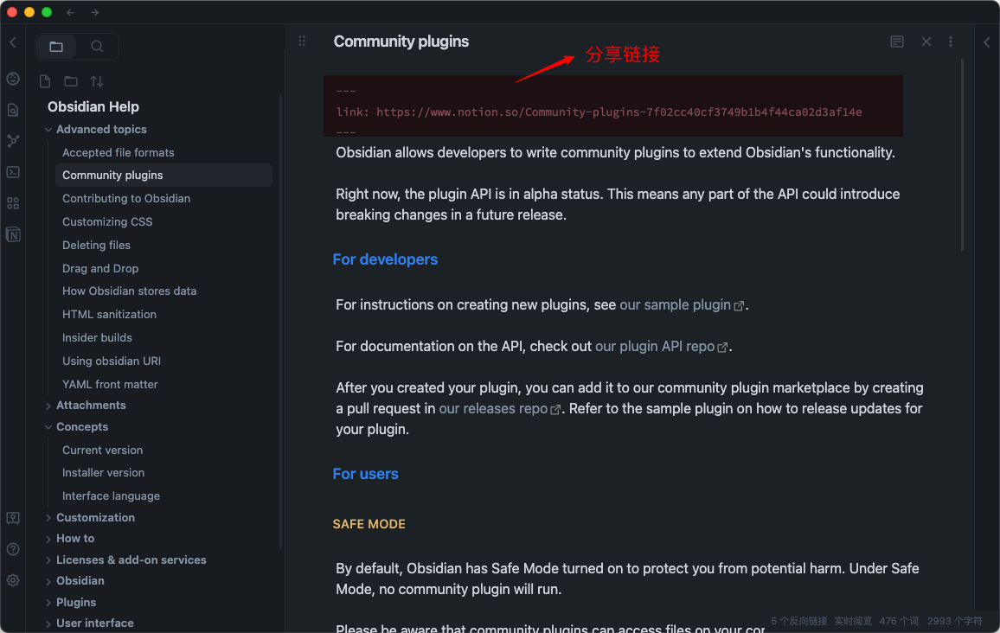
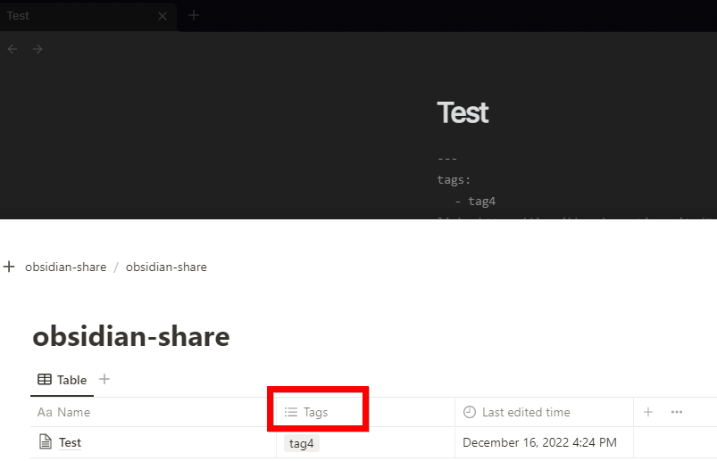
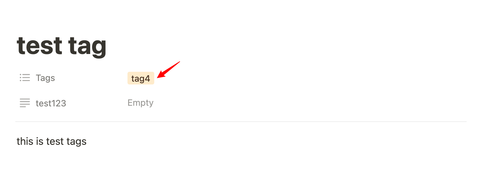
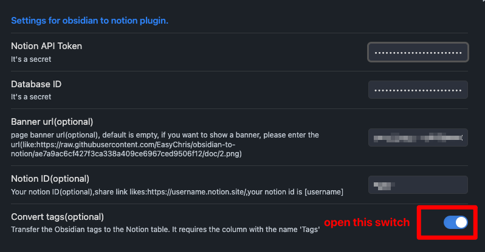

# Obsidian to NotionNext

[](https://github.com/jxpeng98/obsidian-to-NotionNext/actions/workflows/test.yml)
[](https://github.com/jxpeng98/obsidian-to-NotionNext/actions/workflows/release.yml)
[](https://GitHub.com/jxpeng98/obsidian-to-NotionNext/releases/)
[](https://github.com/jxpeng98/obsidian-to-NotionNext/releases/)

[中文文档](README-zh.md)

Thanks to the [original author](https://github.com/EasyChris/obsidian-to-notion) for developing such a useful plugin that can synchronize Obsidian to Notion. However, the original repository can only sync Name and Tag information. For those like me who use [NotionNext](https://github.com/tangly1024/NotionNext) to set up their website, this presents some limitations. Every time I import, I need to make a lot of modifications.

Thus, based on the [original author's work](https://github.com/EasyChris/obsidian-to-notion), I've added a feature to match the [NotionNext](https://github.com/tangly1024/NotionNext) template. This way, you can edit directly in Obsidian and publish with a single click after organizing.

**Now, support both NotionNext and General databases.**

**现在支持NotionNext和普通Notion数据库。**

## TODO List

- [ ] Support custom properties for Notion General database. 支持自定义属性
- [ ] Support preview for database details in plugin settings. 支持预览数据库详情
- [ ] Support edit for database details in plugin settings. 支持编辑数据库详情

## Update
### 2.0.0 (Big Update)

- redesign the plugin settings UI. From this version, the settings UI will be separated into two parts: 
  - one for general settings: bannerUrl and your notion username (ID)
  - one for database list: You can add new database or delete the database.
- 重新设计了插件设置界面。从这个版本开始，设置界面将被分成两部分：
  - 一部分是通用设置：bannerUrl和你的notion用户名（ID）
  - 一部分是数据库列表：你可以添加新的数据库或者删除数据库。


- You can add more databases in the plugin settings.
- 你可以在插件设置中添加更多的数据库。


- You can sync one note to multiple databases.
- 你可以将一个笔记同步到多个数据库中。


**Note: You need to add your previous database in the new template.**
**注意：你需要将之前的数据库添加到新的模板中。**

### 1.1.2
- Fix the typo that you cannot sync the markdown file `status` in the frontmatter to NotionNext. You can use `stats` or `status` to sync the status of the post to NotionNext. This update will not affect the function of syncing to General database. 
- 修复了一个拼写错误，导致无法同步`status`到NotionNext。现在你可以使用`stats`或者`status`来同步文章的状态到NotionNext。这个更新不会影响到同步到General数据库的功能。
- **Both `stats` and `status` will work, but you can only use one of them.**
- **`stats`和`status`都可以使用，但是你只能使用其中一个。**

For example, 
```yaml
stats: Draft # Draft, Invisible, Published, default is Draft， 默认是Draft
# or 
status: Draft # Draft, Invisible, Published, default is Draft， 默认是Draft
# both of them will work, but you can only use one of them.
```

### 1.1.1
- Fix the setting display bug in Japanese.
- Add Japanese translation.

### 1.1.0
- Fix the custom name setting tab display bug. 
- Add a toggle to control whether to sync `tags` since the empty tags may cause the syncing error.

If you switch off the `tags` function in the plugin settings, it will ignore the `tags` in your frontmatter. 

If you prefer to sync tags to Notion database, you can switch on the `tags` function in the plugin settings. **You can only use the following format for tags:**

```yaml
tags: #empty tags, option 1
tags: [test,test1,test2] # use the square brackets, option 2
tags: 
  - test
  - test1
  - test2 # use the dash option 3
```

### 1.0.1

- Fix the custom name element display bug in the settings.

### 1.0.0 (Big Update)

- From this version, you can **modify the first column name (title column, default: 'title')** as you want. (**Note: You need to have the 'tags' column in your Notion General database, and add `tags:` in your markdown frontmatter. If not, you will receive `network error 400`. But you can leave the `tags:` blank.**)


Like this:


- Add a switch button to control whether display the setting tabs in the plugin settings for both NotionNext and Notion General databases.


### 0.2.6

- Add a switch button to control whether to show the upload command in the command palette.

<!-- 
If you turn off the button for the General database, you won't see the option for the General database in the upload command list.

If you turn off the button for the NotionNext database, you won't see the option for the NotionNext database in the upload command list.

 -->

### 0.2.3

- Fix the bug, now you can update normally.

### 0.2.2

- Support both NotionNext and General Notion database.
- You can have one NotionNext and one General Notion database.
- General Notion database can only have `title` and `tags` columns, and `tags` columns should be the multi-selected property. **the name of the columns is case sensitive. You should use small letter.**


### 0.2.1

- Restructure the code

### 0.2.0

- From this version, the interactive logic has been rewritten. When you click the ribbon icon, it will display the sync command for all presetting NotionNext databases. You can choose the database you want to sync to. **However, only NotionNext database is supported for now.**

### 0.1.10

- Fix the Chinese support in the settings.

### 0.1.8

- Rebuild the uploadCommand function, and add one button to select the different databases. **However, only NotionNext database is supported for now.**  

### 0.1.7

- [x] Removed the `convert tag` option. Now, you can directly add tags in the YAML front matter. If you don't want to add tags, you can delete the tags in the YAML front matter or leave the tags blank.

## How to Use

### Precautions

For now, this plugin is exclusively for [NotionNext](https://github.com/tangly1024/NotionNext). If you're not using this template, you'll keep receiving `error 400`.

For those without a NotionNext requirement, please use the original [Obsidian-to-notion](https://github.com/EasyChris/obsidian-to-notion).

### Pre-Installation Steps

Before installing the plugin, you must have set up the following:

1. Your NotionNext database.
2. According to the original author's readme.md, set up the Notion API, and it should already be associated with your NotionNext repository.
3. NotionNext Database ID
4. Your NotionNext database should have the following contents:
    - type
    - title
    - slug
    - category
    - tags
    - date
    - status
    - summary
    - password
    - icon

From version 0.0.6, I also add the following contents:
 - titleicon: the unique icon for each post, it can only support emoji currently.
 - cover url: the cover image for each post, it should be end with a type of image, such as .jpg, .png, .gif, etc.

**If you've directly copied the NotionNext template, these contents should already exist. I've made changes to this plugin based on the original author's work. All you need to ensure is that your database has the above content, and every letter is in lowercase!!!**

**⚠️⚠️⚠️: All headers are in lowercase!!! The order doesn't matter!**

### Plugin Installation

#### Install via Community Plugins

Open `Obsidian settings -> Community Plugins -> Browse -> NotionNext -> Share to NotionNext`

#### Mannually Install

1. Close Obsidian.
2. Download the plugin file from Release and unzip it into your Obsidian plugin directory.
3. Re-open Obsidian, go to settings, and enable the plugin.
4. In the settings, find Obsidian to NotionNext, and enter your NotionNext Database ID and API token.

### How to Use

### Using the Plugin

In the repository, I have uploaded a template which you can directly copy into your template folder. After that, use Obsidian's template feature to create a new note with one click.

If you don't want to use the template, you can also directly create a new file in Obsidian and then copy the content below. Then save it.

```markdown
---
# default value has been set.
# for any unwanted value, you can delete it or set it to empty.
# for example, if you donot want to set password, you can delete password: "1234" or set it to password: ""
# 我已经在插件中设置了默认值，如果有不需要的选项，可以直接删除。
# 例如你不需要密码选项，你可以将password: "1234"删除，或者将它设置为空。
# !!!!!!!!!!!!
# 现在阶段一定不要修改表头的名字， please do not change the name of the header in YAML front matter
# !!!!!!!!!!!!
titleicon: 📎 # emoji icon, default is 📜， 默认是📜
date: 2023-07-23 # default is today， 默认是今天。 Format is YYYY-MM-DD， 格式是YYYY-MM-DD
coverurl: https://img.jxpeng.dev/2023/08/843e27a210847f05a0f7cfb121fec100.jpg # default is empty， 默认是空
type: Post # Post or Page, default is Post， 默认是Post
slug: test # slug for url, default is empty， 默认是空
stats: Draft # Draft, Invisible, Published, default is Draft， 默认是Draft 
category: test # default is 'Obsidian'， 默认是'Obsidian'
summary: this is a summary for test post # default is empty， 默认是空
icon: fa-solid fa-camera # you can ignore this, default is empty， 默认是空，可直接删除
password: "1234" # if you donot want to set password, you can delete this line, default is empty， 默认是空，可直接删除
# 现在必须开启tags选项，否则会报错
tags:
  - test  # tags for post
  - web # add more tags if you want
---

Contents Below

```

Usage of the template is as follows:


**Plugin preview is shown below**


---

**Original README.md**

Many Thanks for the original author's work. I've only made some changes to the original author's work. If you find this plugin useful, please give the [original author](https://github.com/EasyChris/obsidian-to-notion) a star.

# Obsidian to Notion

[](https://github.com/Easychris/obsidian-to-notion/actions/workflows/CI.yml)
[](https://github.com/Easychris/obsidian-to-notion/actions/workflows/release.yml)
[](https://raw.githubusercontent.com/EasyChris/obsidian-to-notion/master/LICENSE)
[](https://GitHub.com/Easychris/obsidian-to-notion/releases/)
[](https://github.com/Easychris/obsidian-to-notion/releases)

Share of obsidian to Notion [中文文档](README-zh.md)

Sharing files from Obsidian to Notion with a single click, and Obsidian will automatically add the Notion share link

You are welcome to offer it a star if it can benefit you.


# TODO

### [TODO Board](https://github.com/users/EasyChris/projects/3/views/1)

- [x] support for custom page banner
- [x] update the exsit page
- [x] support for mult language
- [x] support for auto copy the share link to clipboard
- [x] support for mobile
- [x] support tags thank for [@jannikbuscha](https://github.com/jannikbuscha)
- [ ] transfer the bi-link format like [[]] into the format that Notion supports.

# How to use

## Install the plugin

### Marketplace download

Open obsidian setting -> Add plugin -> Search -> notion


### BRAT

Enter `BRAT` into the plugin market center to find it.
Add `EasyChris/obsidian-to-notion` to the list of BRAT plugins that have been installed.
Return to the plugin center and turn it on.

### Manual installation

```
cd YOUR_OBSIDIAN_FOLDER/.obsidian/plugins/
git clone https://github.com/EasyChris/obsidian-to-notion.git
```

## Apply Notion API

Official reference documentation: [https://developers.notion.com/docs](https://developers.notion.com/docs)

### Step 1: Create integration

Go to [https://www.notion.com/my-integrations](https://www.notion.com/my-integrations)
Once created, copy `secrets toekn`


#### Note

database first custom name must be "Name", otherwise sync to notion will be failed


### Step 2: Share a database with your integration

Create a new page (with public permissions)
Create a new database in the page -> you need `full page database`


Add `integration` to your new database


### Step 3: Copy the database ID

```
https://www.notion.so/myworkspace/a8aec43384f447ed84390e8e42c2e089?v=...
                                  | --------- Database ID --------|

```

## Open the plugin configuration

Fill the configuration with the `NOTION_API_KEY` and `DATABASE_ID` you got


## Upload file content to notion

Click the uploadCommand notion button

A share link will be automatically generated after successful uploadCommand


## Banner URL [option]

Banner url must be a image url like: <https://i.imgur.com/xxx.jpg>
If you don't want to use banner, leave it blank

## Convert Tags [option]

Transfer the Obsidian tags to the Notion table.
It requires the column with the name 'Tags'.


Add tags to your notion page



- open plugin convert tags



- add tags in the head

```markdown
---
tags: [tag1,tag2]
---

this is test tags

```

```markdown
---
tags:
  - tag4
---

this is test tags

```


Thanks for [@jannikbuscha](https://github.com/jannikbuscha) contribution

## Notion ID [option]

Notion ID is the your notion site ID that you want to share the file to.
if you don't write it, notion will share to the default link like:
<https://www.notion.so/myworkspace/a8aec43384f447ed84390>
that visit this page need to redirect to your site url
if you write the Notion ID, it will share to the page link like:
<https://your_user_name.notion.site/myworkspace/a8aec43384f447ed84390>.
The visiter don't need to redirect url.

## Sync image to Notion

To sync images to your oss or cos bucket, use the [Obsidian Image Auto Upload Plugin](https://github.com/renmu123/obsidian-image-auto-upload-plugin).

# Development

```
git clone https://github.com/EasyChris/obsidian-to-notion.git
yarn install
yarn dev
```

## Release

```
node update-version.js
./release.sh
```

```


# Thanks
[Development Process | Obsidian Plugin Development Documentation](https://luhaifeng666.github.io/obsidian-plugin-docs-zh/zh/getting-started/development-workflow.html)

[GitHub - devbean/obsidian-wordpress: An obsidian plugin for publishing docs to WordPress.](https://github.com/devbean/obsidian-wordpress)

[GitHub - obsidianmd/obsidian-api](https://github.com/obsidianmd/obsidian-api)

[GitHub - Easychris/obsidian-to-notion: Obsidian Weread Plugin is an plugin to sync Weread(微信读书) hightlights and annotations into your Obsidian Vault.](https://github.dev/zhaohongxuan/obsidian-weread-plugin)

[GitHub - Quorafind/Obsidian-Memos: A quick capture plugin for Obsidian, all data from your notes.](https://github.com/Quorafind/Obsidian-Memos)

[https://github.com/jannikbuscha/obsidian-to-notion](https://github.com/jannikbuscha)

# License
GNU GPLv3
